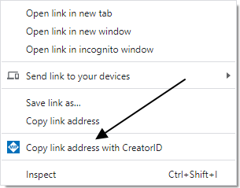
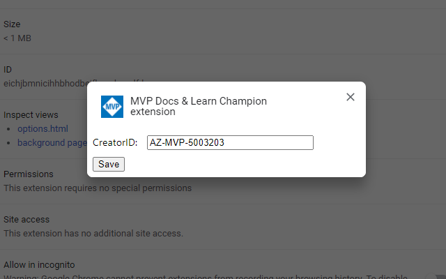

# MVP Docs & Learn Champion extension

This extension adds a 'Copy link address with CreatorID' item to your Browser on suitable sites.
It also ensures that the CreatorID is correctly added to the URL, so you don't have to worry about whether the URL already contains a query.

Don't forget to set the CreatorID in the extension options:

