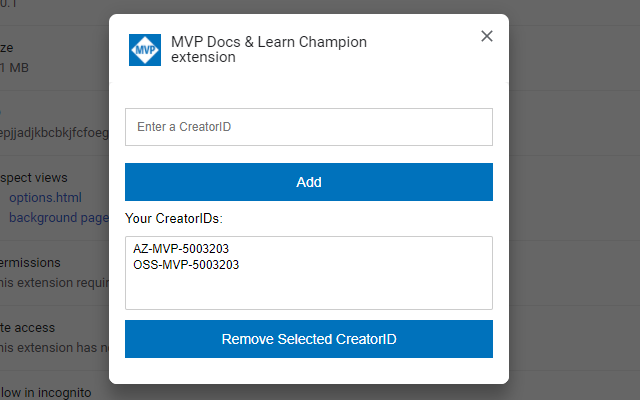
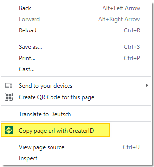
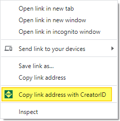
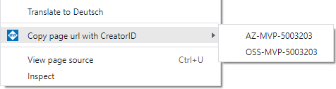

Available for Chrome, Edge and Firefox:

# Skilling Champion extension

This extensions allows you to copy a link / page url with your Skilling Champion CreatorID.

It ensures that the CreatorID is correctly added to the URL, so you don't have to worry about whether the URL already contains a query. It also provides the option to make English URL "language neutral" by removing "en-us" - this will enable most Microsoft sites to detect the preferred language of the user and serve the content in that language.

## Usage

### 1. Configure Options

After you have installed the extension, please specify your CreatorIDs within the extension options:

You can also check "Make English URLs language-neutral" or "Make language-specific URLs language-neutral" to make your links more friendly to a global audience. These language-neutral URLs will allow the destination website to match the user's language preference. 
The first option will only transform English URLs (that contain "en-us") while the second will transforms URLs of any language.

### 2. Use the extension

After you have specified your CreatorID you will have two options to create a link including your CreatorID

* **Copy a page url** - right click anywhere on a [suitable page](#suitable-sites) and select "*Copy page url with CreatorID*"

* **Copy a link** - right click on a **link** on a [suitable page](#suitable-sites) and select "*Copy link address with CreatorID*"

**Note:** If you have specified multiple CreatorIDs, the context menues will allow you to choose one of them:

## suitable Sites

Currently, the Skilling Champion program tracks references from the following sites:

* https://azure.microsoft.com
* https://blog.fabric.microsoft.com
* https://blogs.msdn.microsoft.com
* https://blogs.technet.microsoft.com
* https://channel9.msdn.com
* https://cloudblogs.microsoft.com
* https://code.visualstudio.com
* https://community.fabric.microsoft.com
* https://csc.docs.microsoft.com
* https://devblogs.microsoft.com
* https://developer.microsoft.com
* https://docs.azure.cn
* https://docs.microsoft.com
* https://gallery.technet.microsoft.com
* https://learn.microsoft.com
* https://microsoft.com/handsonlabs
* https://msdn.microsoft.com
* https://powerbi.microsoft.com
* https://social.msdn.microsoft.com
* https://social.technet.microsoft.com
* https://techcommunity.microsoft.com
* https://technet.microsoft.com
* https://www.azure.cn
